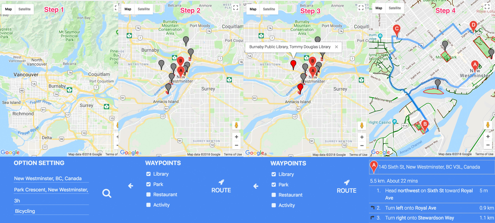
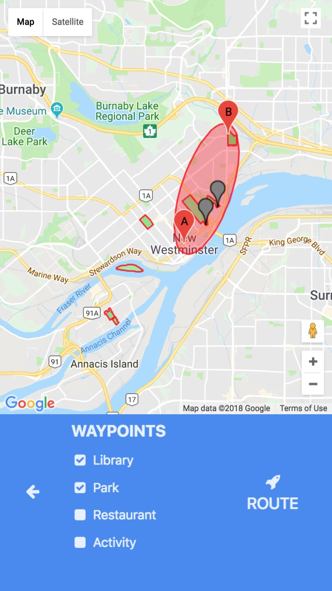

# Discover-NW
A mobile web application to give travel plan suggestion

## Install
Pull this repo and run

```
npm install
```

## How to run

### Run the app
It is suggested to run this back-end on server and access application on your smart devices through port number 8080

```
node app.js
```

### Specify the start position and destination


